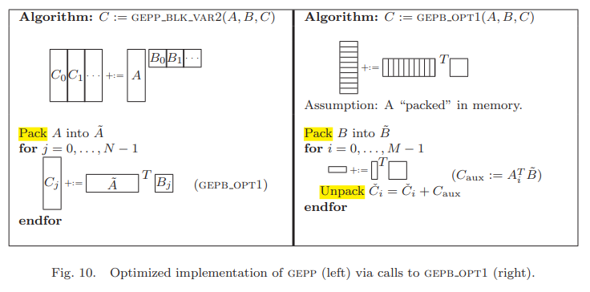

# Faster Matrix Multiplication

    12111224  
    贾禹帆

## 需求分析

运用SIMD指令和OPENMP库加快矩阵计算并且根据不同cpu自动选择最佳实现，根据不同平台需要采用不同的库和函数

### 注意要点

- openmp相当于将for循环拆分成多个线程执行，查阅文档得知除了private memory，各个线程共用一块内存并且不会上互斥锁，因此需要保证各线程存在写操作的内存段不被其他线程访问(同时读取不会产生问题)
- 由于矩阵大小随意，在创建时进行内存对齐会在堆空间中空出大量无法使用的碎片空间，因此不能使用对已对齐内存进行矢量读取的SIMD函数
- 矩阵乘法的主要瓶颈在IO而不是cpu，查阅资料得知cpu每个核都有自己的一二级缓存，多个核共用一块三级缓存。每次读取一个线性地址空间的数据时，cpu会先在缓存中搜索，若数据不存在(cache miss)，再从TLB中搜索是否存有对应物理地址(TLB一般也有分级，类似于一二极缓存的关系)，不存在再搜索页表(Linux是二级页表，从页表目录开始搜索然后找到页表再搜,会很慢，因此TLB miss比cache miss更严重)，最后从内存中复制到缓存中
- 低复杂度的高级矩阵乘法常数太大且额外空间开销太大，理论上用处不大，~~但是实测openmp并行跑Coppersmith-Winograd法能跑OpenBLAS的2/3~~, 需要注意的是由于高级矩阵乘法将部分乘法化为了加法，若过程中数据溢出会导致结果不同，此外由于减少了乘法次数，对于精度的要求也更低。由于float的精度过低，大矩阵下误差累积会导致和传统算法的结果不同，需要double
- cpu对访问连续地址有优化，重排离散的内存到一块连续的内存上会降低cache miss的几率
- openblas底层小矩阵乘法是内联汇编直接操作寄存器，~~所以同核数打不过的~~

## 实现

### cpu架构,参数检测

- Linux上检测cpu支持SIMD指令的方法为`lscpu`(provided by util-linux) or `cat /porc/cpuinfo`然后处理输出得到，需要cmake在编译前预处理这部分信息并添加恰当的编译器命令行参数和宏定义(windows适配放弃了)
- 同上可以获得CPU核数，线程数和三缓大小
- 根据定义的宏确定cpu支持的SIMD指令,优先使用最新版本的指令(默认不使用AVX512的512bits位宽矢量操作，除非用户定义`FORCE_USE_AVX512`,原因是使用AVX512会使cpu降频，带来的计算提升反而被抵消了[详情](https://www.phoronix.com/news/LLVM-Clang-10-AVX512-Change))

## 实现

>实现了KAZUSHIGE GOTO的论文(~~丐中丐实现~~)

### 矩阵分解

因为是行主序，所以选择了分解A的列和B的行

首先按照K方向分解，得到宽度相同的两个panel,然后将A,C分解成更小的向量(为了能够放进l1缓存),进行计算后再写回C

### 数组重排

为了让数据在内存中连续，并且尽可能内存对齐以支持SIMD并减少cache miss，对矩阵进行了重排，将每个分开的行首尾相接，并对B做了转置使其变为列主序，方便之后的SIMD运算,解包同理，为逆运算

```c++
enum FORMAT { RM = 0, CM = 1 };  // row main or column main
enum TRAN { TRAN = 0, NTRAN = 1 };

void pack(const float* ori, float* trg, const size_t ldo, const size_t row_size, const size_t col_size, enum FORMAT f,
          enum TRAN t) {
    switch(f) {
        case RM:
            if(t == NTRAN) {
                for(size_t i = 0; i < row_size; ++i)
                    memcpy(trg + col_size * i, ori + ldo * i, sizeof(float) * col_size);
                return;
            } else if(t == TRAN) {
                float* tmp = trg;
                for(size_t i = 0; i < col_size; ++i)
                    for(size_t j = 0; j < row_size; ++j)
                        *tmp++ = ori[i + col_size * j];
                return;
            } else
                abort();
        case CM:
            if(t == NTRAN) {
                for(size_t i = 0; i < col_size; ++i)
                    memcpy(trg + row_size * i, ori + ldo * i, sizeof(float) * row_size);
                return;
            } else if(t == TRAN) {
                float* tmp = trg;
                for(size_t i = 0; i < row_size; ++i)
                    for(size_t j = 0; j < col_size; ++j)
                        *tmp++ = ori[i + row_size * j];
                return;
            } else
                abort();
        default:
            abort();
    }
}

void unpcak(const float* ori, float* trg, const size_t ldo, const size_t row_size, const size_t col_size, enum FORMAT f,
            enum TRAN t) {
    switch(f) {
        case RM:
            if(t == NTRAN) {
                for(size_t i = 0; i < row_size; ++i)
                    memcpy(trg + ldo * i, ori + col_size * i, sizeof(float) * col_size);
                return;
            } else if(t == TRAN) {
                float* tmp = trg;
                for(size_t i = 0; i < col_size; ++i)
                    for(size_t j = 0; j < row_size; ++j)
                        *tmp++ = ori[i + col_size * j];
                return;
            } else
                abort();
        case CM:
            if(t == NTRAN) {
                for(size_t i = 0; i < col_size; ++i)
                    memcpy(trg + row_size * i, ori + ldo * i, sizeof(float) * row_size);
                return;
            } else if(t == TRAN) {
                float* tmp = trg;
                for(size_t i = 0; i < row_size; ++i)
                    for(size_t j = 0; j < col_size; ++j)
                        *tmp++ = ori[i + row_size * j];
                return;
            } else
                abort();
        default:
            abort();
    }
}
```

### 计算

虽然编译器o2以上会有自动SIMD优化，但是由于这玩意是个黑盒，所以计算方面选择手动SIMD,从对齐的内存加载数据，计算完后写回缓冲,同时通过移动指针来写入指(连续下标会被编译器自动优化)

```c++
for(size_t m = 0; m < M; ++m)
        if(!K_step % 8) {
            float* res = aligned_alloc(32, sizeof(float) * 8);
            float* tmp_C = &sub_C[m * N_step];
            __m256 A256, B256, C256;
            for(int n = 0; n < N_step; ++n) {
                float* tmp_B = sub_B;
                A256 = _mm256_load_ps(sub_A);
                for(int k = 0; k < K_step; ++k) {
                    B256 = _mm256_load_ps(tmp_B);
                    C256 = _mm256_mul_ps(A256, B256);
                    _mm256_store_ps(res, C256);
                    *(tmp_C++) += res[0] + res[1] + res[2] + res[3] + res[4] + res[5] + res[6] + res[7];
                    tmp_B += K_step;
                }
            }
            free(res);
        } else
            for(int k = 0; k < K_step; ++k)
                for(int n = 0; n < N_step; ++n)
                    sub_C[m * N_step + n] += sub_A[m * K_step + k] * sub_B[n * N_step + k];
```

### 架构，缓冲大小数据的获取

```cmake
execute_process(COMMAND sh -c "uname -m | tr -d '\n'" OUTPUT_VARIABLE ARCHITECTURE)
execute_process(COMMAND sh -c "lscpu|grep -o \"avx512\" | tr -d '\n'" OUTPUT_VARIABLE AVX512_SUPPORT)
execute_process(COMMAND sh -c "lscpu|grep -o \"avx_vnni\" | tr -d '\n'" OUTPUT_VARIABLE AVX_VNNI_SUPPORT)
execute_process(COMMAND sh -c "lscpu|grep -o \"avx2\" | tr -d '\n'" OUTPUT_VARIABLE AVX2_SUPPORT)
execute_process(COMMAND sh -c "lscpu|grep -o \"avx\" | tr -d '\n'" OUTPUT_VARIABLE AVX_SUPPORT)
execute_process(COMMAND sh -c "lscpu|grep -o \"asimd\" | tr -d '\n'" OUTPUT_VARIABLE ASIMD_SUPPORT)
execute_process(COMMAND sh -c "lscpu|grep \"NUMA node0 CPU(s):\"
|tr -d \"NUMA node0 CPU(s) : \n -\"" OUTPUT_VARIABLE CPU_CORES)
execute_process(COMMAND sh -c "lscpu|grep \"L2\"|perl -pe \"s/L2 cache://\"
|tr -d \"MiB instances \n\"|perl -pe \"s/\([^1-9][^ ][^ ]\)//\"" OUTPUT_VARIABLE CPU_L2CACHE)
execute_process(COMMAND sh -c "lscpu|grep \"L1d\"|perl -pe \"s/L1d cache://\"
|tr -d \"KiB instances \n\"|perl -pe \"s/\([^1-9][^ ][^ ][^ ]\)//\"" OUTPUT_VARIABLE CPU_L1CACHE)

add_definitions(-DCORES_NUM=${CPU_CORES}+1)
add_definitions(-DL1CACHE=\(${CPU_L1CACHE}*1024\))
add_definitions(-DL2CACHE=\(${CPU_L2CACHE}*1024*1024\))

message(STATUS "Current architecture: ${ARCHITECTURE}")
if(${ARCHITECTURE} STREQUAL "x86_64" OR ${ARCHITECTURE} STREQUAL "x86_32")
  add_definitions(-D__X86__)
  if(NOT ${AVX512_SUPPORT} STREQUAL "")
    message(STATUS "Use SIMD AVX-512")
    add_compile_options(-mavx512f -mavx512cd)
  elseif(NOT ${AVX_VNNI_SUPPORT} STREQUAL "")
    message(STATUS "Use SIMD: AVX_VNNI")
    add_compile_options(-mavxvnni -mavx2)
  elseif(NOT ${AVX2_SUPPORT} STREQUAL "")
    message(STATUS "Use SIMD: AVX2")
    add_compile_options(-mavx2)
  elseif(NOT ${AVX_SUPPORT} STREQUAL "")
    message(STATUS "Use SIMD: AVX")
    add_compile_options(-mavx)
  else()
    add_definitions(-D__NO_SIMD__)
    message("You CPU doesn't support proper SIMD")
  endif()
elseif(${ARCHITECTURE} STREQUAL "aarch64")
  add_definitions(-D__ARM__)
  if(NOT ${ASIMD_SUPPORT} STREQUAL "")
    message(STATUS "Use SIMD: ASIMD")
    add_compile_options(-ftree-vectorize)
  else()
    add_definitions(-D__NO_SIMD__)
    message("You CPU doesn't support proper SIMD")
  endif()
endif()
```

## 测试结果

由于openblas通过内联汇编的方式直接调用寄存器进行计算，小矩阵的优化远强于纯c,最后效果也不理想,但相较于原先朴素的矩阵乘法有了大幅提升

```text
//一下为7000*7000矩阵乘法计算对比
==========================================================
Plain matrix multiply time cost 317.056488 s
==========================================================
Improved matrix multiply time cost 11.175777 s
==========================================================
OpenBlas matrix multiply time cost 4.730838 s
==========================================================
```

关于更多测试结果,请查看github仓库的log文件夹

## Reference

Openmp:

- [RefCard](https://www.openmp.org/wp-content/uploads/OpenMPRefCard-5-2-web.pdf)
- [API](https://www.openmp.org/wp-content/uploads/OpenMP-API-Specification-5-2.pdf)

Intel Intrinsics:

- [Intel® Intrinsics Guide](https://www.intel.com/content/www/us/en/docs/intrinsics-guide/index.html)

ARM Neon Intrinsics:

- [Intrinsics](https://developer.arm.com/architectures/instruction-sets/intrinsics/)

BLAS:

- [Netlib](https://netlib.org/blas/#_level_3)
- [OpenBLAS分析](https://blog.csdn.net/frank2679/article/details/113243044#2-openblas%E5%AE%9E%E7%8E%B0)

Paper:

- [Anatomy of High-Performance MatrixMultiplication](https://www.cs.utexas.edu/users/flame/pubs/GotoTOMS_final.pdf)

